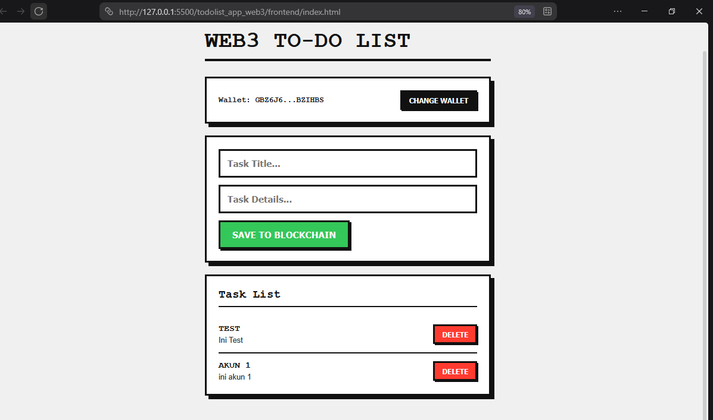

# Web3 To-Do List (Stellar & Soroban)

## 📝 Description
Web3 To-Do List is a simple, decentralized task management application built on the Stellar blockchain using the Soroban smart contract SDK. This project demonstrates how to interact with the Stellar network using a lightweight Vanilla JavaScript frontend and a Rust-based smart contract. 

The user interface features a bold, Neo-Brutalism design aesthetic, ensuring a clean, straightforward, and resilient user experience while interacting with decentralized technologies.

## ✨ Features
- **Wallet Integration:** Seamlessly connect using the Freighter Wallet extension.
- **Decentralized Storage:** Add new tasks and store them directly on the Stellar Testnet blockchain.
- **Read On-Chain Data:** Fetch and display the list of tasks stored in the smart contract.
- **Lightweight Frontend:** Built with Vanilla HTML/JS/CSS without heavy frameworks for maximum performance and fast loading times.

## 🔗 Smart Contract
This application interacts with a smart contract deployed on the Stellar Testnet.
- **Network:** Stellar Testnet
- **Contract ID:** CB7HQHDN4O7P5DMJPKGQ5GO7SZXS7XMIF4C73TUL36S7UDN6KHEODO2D

## 📸 Screenshot

